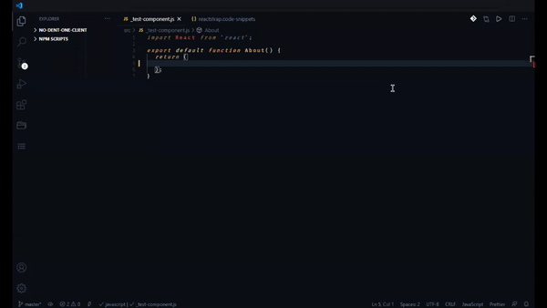

# React Component Explorer

Shows a list of React components in a sidebar panel and allows you to quickly add the component to your file.

Use my other extension [React Snippet Generator](https://marketplace.visualstudio.com/items?itemName=ObsessiveCoder.react-snippet-generator) to generate snippets for your React components.

# How It Works

The list of components are populated from VS Code snippets. When you insert a component, its snippet is used to add it to the code editor. In theory, this should work with any VS Code snippets.

# Usage

1. Use the new icon on the sidebar to show the components explorer.
2. Click the `Add Component Library` button.
3. Choose the snippets for your component library.
4. Find your component in the list and add it to the file by clicking the `+` button.

# Coming Soon

* Allow generating snippets from the explorer panel if [React Snippet Generator](https://marketplace.visualstudio.com/items?itemName=ObsessiveCoder.react-snippet-generator) is installed.
* Drag-n-Drop from component explorer to file.